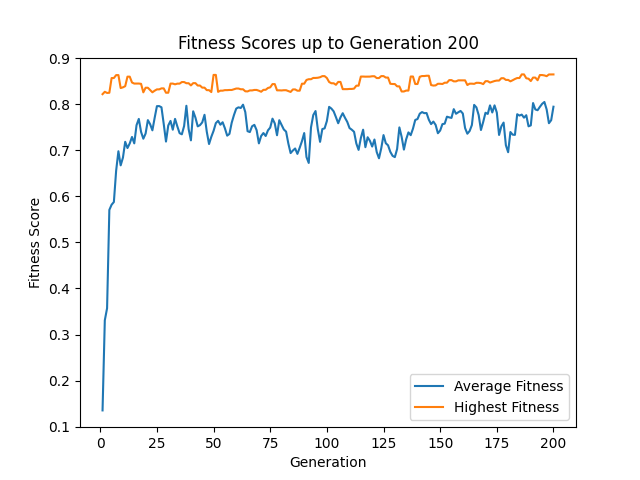

# AutoML Assignment on Federated EMNIST Dataset

### Overview
This project implements a 2-layer feed-forward neural network for image classification on a subset of the Federated EMNIST dataset. The main task is to fine-tune hyperparameters using Genetic Algorithms and Bayesian Optimization to achieve the best performance measured by the macro-averaged F1 score.

### Dataset
The dataset used is a subset of the Federated EMNIST dataset, specifically focusing on digit images (10 classes). It includes:
- train_X.npy
- train_y.npy
- test_X.npy
- test_y.npy

### Neural Network Model
The model is a simple 2-layer neural network with one hidden layer consisting of 128 units.

### Structure
- Input Layer: Size varies depending on the flattened image size.
- Hidden Layer: 128 units.
- Output Layer: 10 units (one for each class).

### Hyperparameter Tuning
Two methods are used for hyperparameter tuning:
1. **Genetic Algorithm**: Custom implementation without using specialized packages.
2. **Bayesian Optimization**: Implemented using the `bayes_opt` package.

### Parameters Tuned
- Mini-batch size (From 16 to 1024)
- Activation function for the hidden layer (ReLU, Sigmoid, Tanh)

<u>Running the Code</u>
1. Install the required packages from `requirements.txt`.
2. You can either run the code for part 1 or 2:
- Part 1: `python 04_hw_q1_code.py`
- Part 2: `python 04_hw_q2_code.py`
3. Results will be displayed in the console and plots will be saved in the `artifacts` folder.

### Optimization Results

**Training Plots:**
Genetic Algorithm

Bayesian Optimization

### Testing Results

**Best hyperparameters found by algorithm:**
Genetic Algorithm:
- Batch Size: `21`
- Activation Function: `relu`

Bayesian Optimization:
- Batch Size: `25`
- Activation Function: `tanh`

**Training F1 scores:**

**Test F1 Scores:**
- Genetic Algorithm: `0.94786`
- Bayesian Optimization: `0.95530`

## Analysis of Hyperparameter Tuning Methods

### Hyperparameter Choices:
The Genetic Algorithm (GA) and Bayesian Optimization (BO) methods selected different hyperparameters for the neural network model. GA opted for a batch size of 21 and the ReLU activation function, while BO selected a batch size of 25 and the tanh activation function.

### Pros and Cons:

**Genetic Algorithm (GA):**
- **Pros:**
  - Explores a wide solution space through a process similar to natural selection, which can lead to diverse hyperparameter combinations.
  - Reduces the chances of getting trapped in local optima due to its population-based approach.
- **Cons:**
  - Computationally intensive as it evaluates numerous candidates across multiple generations.
  - Requires careful tuning of its own meta-parameters, such as mutation and crossover rates, adding another layer of complexity.

**Bayesian Optimization (BO):**
- **Pros:**
  - Efficient in terms of computational resources as it uses past evaluations to inform the next set of hyperparameters to explore.
  - Tends to find better solutions with fewer function evaluations compared to random or uninformed search strategies.
- **Cons:**
  - Can become trapped in local optima if the model's assumptions about the objective function do not hold.
  - Performance is highly dependent on the chosen prior and the surrogate model, which might require domain expertise to set effectively.

### Comparative Performance:
In terms of the final F1 scores obtained from both methods, the Bayesian Optimization achieved a slightly higher F1 score on the test set (0.9553) compared to the Genetic Algorithm (0.9478), which suggests that for this specific task, BO was more effective in tuning the hyperparameters to achieve a better performing model.

Given the performance metrics, it is crucial to consider both the effectiveness of the hyperparameter optimization method and the computational resources available when choosing between these two approaches for neural network tuning.

